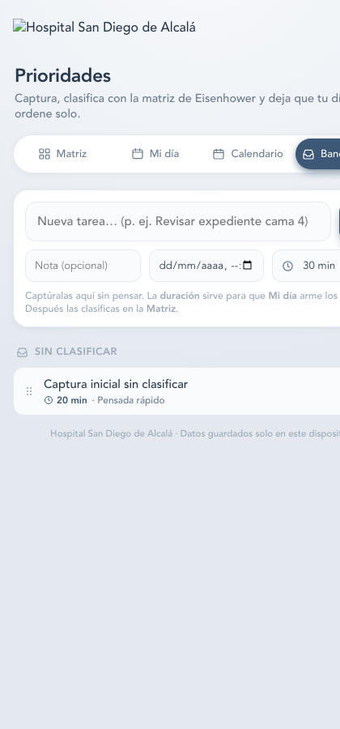
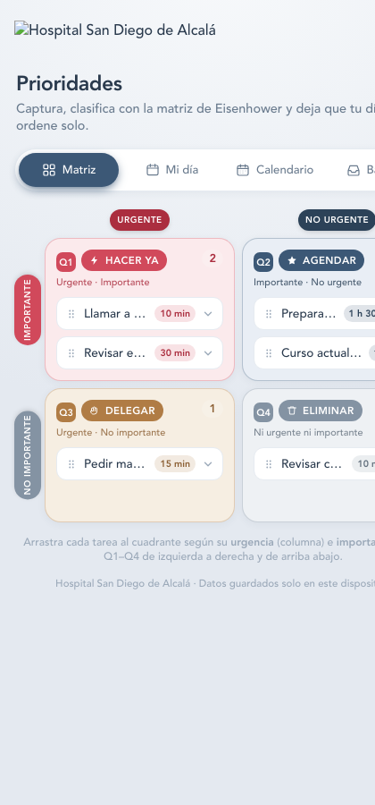
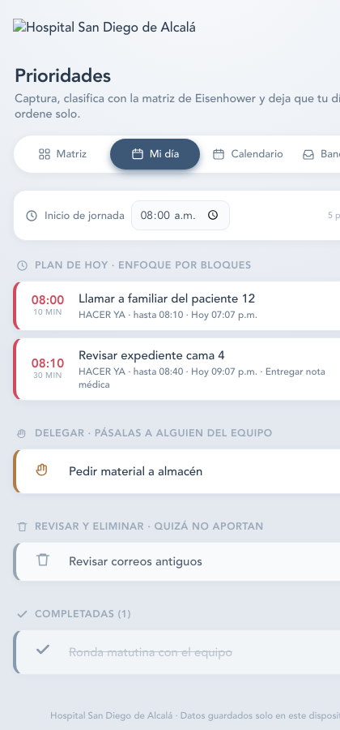
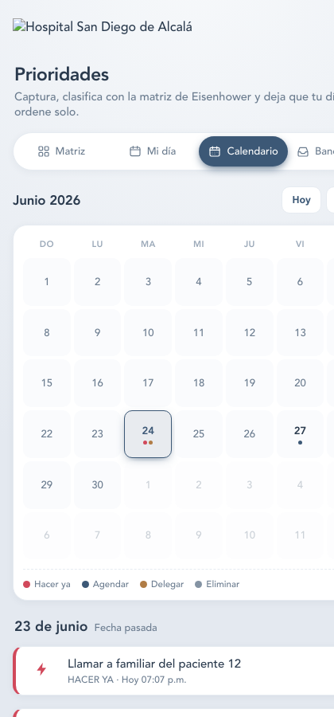

# 📋 Instructivo de uso — Prioridades · HSDA

**Aplicación de gestión de prioridades con Matriz de Eisenhower**
Hospital San Diego de Alcalá

> 🌐 **Enlace de la app:** <https://fimbresr.github.io/prioridades-hsda/>
>
> Funciona sin conexión a internet y se puede instalar como aplicación en el celular o la computadora. Los datos se guardan **solo en tu dispositivo**.

---

## 📑 Contenido

1. [¿Para qué sirve esta app?](#1-para-qué-sirve-esta-app)
2. [Instalación en el celular o computadora](#2-instalación-en-el-celular-o-computadora)
3. [Las 4 vistas (pestañas)](#3-las-4-vistas-pestañas)
4. [Paso 1 · Capturar tareas (Bandeja)](#paso-1--capturar-tareas-bandeja)
5. [Paso 2 · Clasificar con la Matriz](#paso-2--clasificar-con-la-matriz)
6. [Paso 3 · Ver tu día organizado (Mi día)](#paso-3--ver-tu-día-organizado-mi-día)
7. [Paso 4 · Programar varios días (Calendario)](#paso-4--programar-varios-días-calendario)
8. [Los 4 cuadrantes de Eisenhower](#los-4-cuadrantes-de-eisenhower)
9. [Regla clave: Mi día vs. Calendario](#regla-clave-mi-día-vs-calendario)
10. [Acciones sobre una tarea](#acciones-sobre-una-tarea)
11. [Tema claro / oscuro](#tema-claro--oscuro)
12. [Preguntas frecuentes](#preguntas-frecuentes)

---

## 1. ¿Para qué sirve esta app?

Te ayuda a **decidir qué hacer primero** usando la Matriz de Eisenhower. El flujo es simple:

1. **Capturas** todo lo que tienes que hacer (sin pensar en orden).
2. **Clasificas** cada tarea en uno de 4 cuadrantes según urgencia e importancia.
3. La app **arma tu día automáticamente** y te **programa los días futuros**.

No necesitas internet ni cuenta. Todo vive en tu dispositivo.

---

## 2. Instalación en el celular o computadora

La app es una **PWA** (aplicación web progresiva): se instala como una app normal pero se abre desde el navegador.

### 📱 En Android (Chrome)

1. Abre <https://fimbresr.github.io/prioridades-hsda/> en Chrome.
2. Toca el menú **⋮** (arriba a la derecha).
3. Selecciona **"Agregar a pantalla de inicio"** o **"Instalar aplicación"**.
4. Confirma. Quedará un ícono en tu pantalla de inicio.

### 🍎 En iPhone / iPad (Safari)

1. Abre el enlace en **Safari**.
2. Toca el botón **Compartir** (cuadrado con flecha hacia arriba).
3. Selecciona **"Añadir a pantalla de inicio"**.
4. Toca **Añadir**. Se creará un ícono como el de cualquier app.

### 💻 En computadora (Chrome o Edge)

1. Abre el enlace en Chrome o Edge.
2. Haz clic en el ícono **⊕ Instalar** que aparece en la barra de direcciones.
3. Confirma. La app se abrirá en su propia ventana.

> 💡 Una vez instalada, funciona **sin internet**. Para actualizarla, solo vuelve a abrirla con conexión; se descargará sola la versión nueva.

---

## 3. Las 4 vistas (pestañas)

En la parte inferior verás 4 pestañas:

| Pestaña | Para qué sirve |
|---|---|
| **Matriz** | Clasificar tus tareas en los 4 cuadrantes |
| **Mi día** | Tu agenda de HOY, armada por bloques de tiempo |
| **Calendario** | Ver y programar tareas de otros días |
| **Bandeja** | Capturar tareas nuevas rápidamente |

---

## Paso 1 · Capturar tareas (Bandeja)

La **Bandeja** es donde anotas todo lo que tienes pendiente, sin preocuparte por el orden ni la prioridad.



### Cómo capturar

1. Escribe el nombre de la tarea en **"Nueva tarea…"**.
   - Ejemplo: `Revisar expediente cama 4`
2. *(Opcional)* Agrega una **nota** con detalles.
3. *(Opcional)* Asigna una **fecha límite** con día y hora.
4. Elige la **duración estimada** (5 min a 2 h). Esto sirve después para que "Mi día" arme tus bloques de tiempo.
5. Toca el botón **＋** o presiona **Enter**.

La tarea aparecerá abajo en **"Sin clasificar"**, esperando a que la clasifiques en la Matriz.

> 🧠 **Consejo:** Captura sin filtrar. Mejor anotar de más y luego eliminar, que olvidar algo importante.

---

## Paso 2 · Clasificar con la Matriz

La **Matriz** distribuye tus tareas en 4 cuadrantes según **urgencia** (eje horizontal) e **importancia** (eje vertical), con la organización clásica de Eisenhower y cada cuadrante numerado de **Q1 a Q4**.



### Cómo leer la matriz

```
                    Urgente          No urgente
                 ┌─────────────────┬─────────────────┐
  Importante     │  Q1 · HACER YA  │  Q2 · AGENDAR   │
                 ├─────────────────┼─────────────────┤
  No importante  │  Q3 · DELEGAR   │  Q4 · ELIMINAR  │
                 └─────────────────┴─────────────────┘
```

- **Columnas** (←→): izquierda = Urgente · derecha = No urgente
- **Filas** (↑↓): arriba = Importante · abajo = No importante
- Las etiquetas de los ejes aparecen como **pastillas de color resaltadas** para que se vean claro al clasificar.
- Cada cuadrante tiene su **badge Q1–Q4** y su etiqueta (Hacer ya, Agendar, Delegar, Eliminar).

### Cómo clasificar una tarea

Al soltar una tarea en un cuadrante, **se clasifica automáticamente** en su categoría:

**En computadora (arrastrar):**
1. Ve a la pestaña **Matriz**.
2. Arrastra la tarea desde "Sin clasificar" (o desde otro cuadrante) hacia el cuadrante que corresponda según su urgencia e importancia.
3. Suelta. La tarea queda asignada a ese Q1–Q4.

**En celular (tocar):**
1. Toca la tarea que quieres clasificar.
2. Se abre un **panel** abajo con las 4 opciones numeradas (Q1–Q4).
3. Toca el cuadrante destino: **Q1 Hacer ya**, **Q2 Agendar**, **Q3 Delegar** o **Q4 Eliminar**.

### Revisar una tarea dentro de la matriz

Las tareas dentro de la matriz están **colapsadas** para que veas más de un vistazo:

- **Toca** una tarea para expandirla.
- Verás su nota, fecha límite y botones para **moverla** a otro cuadrante, **marcarla hecha** o **eliminarla**.
- Toca de nuevo para colapsarla.

> 💡 Un **punto rojo** junto a una tarea significa que está **vencida** (la fecha límite ya pasó).

---

## Paso 3 · Ver tu día organizado (Mi día)

**Mi día** arma automáticamente tu agenda del día de hoy, encadenando bloques de tiempo según la duración de cada tarea.



### Qué muestra

- **Plan de hoy · enfoque por bloques:** tus tareas "Hacer ya" y "Agendar" de hoy, con hora de inicio y fin calculada a partir de la **hora de inicio de jornada** (por defecto 08:00) y la duración de cada tarea.
  - Ejemplo: si empiezas a las 8:00 y la primera tarea dura 30 min → bloque 08:00–08:30. La siguiente empieza a las 08:30.
- **Delegar:** tareas que debes pasar a alguien del equipo.
- **Revisar y eliminar:** tareas que probablemente no aportan.
- **Completadas:** lo que ya marcaste como hecho.

### Cómo usarlo

1. Define tu **hora de inicio de jornada** (arriba, donde dice "Inicio de jornada").
2. Los bloques se recalculan solos.
3. Marca cada tarea como **✓ hecha** según avances.

> ⚠️ **Importante:** Mi día **solo muestra tareas de HOY** (y las vencidas). Las que programaste para otro día **no aparecen aquí** — están en el Calendario. [Ver regla clave](#regla-clave-mi-día-vs-calendario).

---

## Paso 4 · Programar varios días (Calendario)

El **Calendario** te deja ver y programar tareas para cualquier día, organizadas por importancia.



### Qué muestra

- Una **rejilla mensual** (lunes a domingo).
- Cada día tiene **puntos de color** según las tareas que tiene:
  - 🔴 rojo = Hacer ya
  - 🔵 azul = Agendar
  - 🟤 café = Delegar
  - ⚪ gris = Eliminar
- Abajo, una **leyenda** explica los colores.

### Cómo usarlo

1. **Navega entre meses** con los botones **‹** y **›**.
2. Toca **"Hoy"** para volver al mes y día actual.
3. **Toca cualquier día** para ver abajo la lista de sus tareas, **ordenadas por importancia** (Hacer ya primero, luego Agendar, Delegar y Eliminar).
4. Desde ahí puedes marcar una tarea como hecha o tocarla para abrir el panel de acciones.

### Programar varios días desde un solo momento

Esta es la ventaja clave: puedes, en un solo rato, **capturar y programar toda la semana**:

1. Ve a la **Bandeja** y captura todas las tareas que tengas en mente.
2. A cada una asígnale su **fecha límite** (lunes, martes, etc.).
3. Clasifícalas en la **Matriz**.
4. En el **Calendario** confirma que cada día quedó bien repartido.
5. Cada día, al llegar, esas tareas aparecerán solas en **Mi día**.

---

## Los 4 cuadrantes de Eisenhower

| # | Cuadrante | Color | Significado | Qué hacer |
|---|---|---|---|---|
| **Q1** | **HACER YA** | 🔴 | Urgente **e** importante | Hazlo hoy, cuanto antes |
| **Q2** | **AGENDAR** | 🔵 | Importante, **no** urgente | Programarlo con tiempo, no dejarlo al último |
| **Q3** | **DELEGAR** | 🟤 | Urgente, **no** importante | Pásalo a alguien del equipo |
| **Q4** | **ELIMINAR** | ⚪ | Ni urgente ni importante | Revísalo; probablemente no aporta — elimínalo |

**Guía rápida para decidir:**
- ¿Pasa algo grave si no lo hago hoy? → **Urgente**
- ¿Está alineado con mis objetivos/responsabilidades reales? → **Importante**

---

## Regla clave: Mi día vs. Calendario

Para que la planificación funcione, la app separa lo de hoy de lo de otros días:

| Estado de la tarea | ¿Aparece en Mi día? | ¿Aparece en Calendario? |
|---|---|---|
| Sin fecha asignada | ✅ Sí (hasta que la programes o completes) | ❌ No |
| Fecha = **hoy** | ✅ Sí | ✅ Sí (en el día de hoy) |
| Fecha **vencida** (ya pasó) | ✅ Sí | ✅ Sí |
| Fecha = **otro día (futuro)** | ❌ **No** | ✅ Sí (solo en su día) |

**¿Por qué?** Si programaste algo para el viernes, **no debe mezclarse con tu día de hoy**. Así puedes planificar varios días a la vez sin saturar tu agenda actual. Cuando llegue el viernes, esa tarea aparecerá sola en Mi día.

Si Mi día está vacío pero tienes tareas programadas, verás un aviso: *"Hoy no hay tareas pendientes. Tienes **N** programada(s) para otros días. míralas en el Calendario."*

---

## Acciones sobre una tarea

Desde cualquier vista, al **tocar una tarea** se abre un panel (en celular) o se expande (en la matriz) con estas opciones:

| Acción | Qué hace |
|---|---|
| **Mover a cuadrante** | Cambia la tarea a Hacer ya / Agendar / Delegar / Eliminar |
| **✓ Marcar hecha** | La marca como completada (pasa a "Completadas") |
| **↩ Reabrir** | Vuelve una tarea completada a pendiente |
| **🗑 Eliminar** | Borra la tarea definitivamente |

> 💡 La app **vibra** levemente al confirmar acciones (si tu dispositivo lo permite).

---

## Tema claro / oscuro

Arriba a la derecha hay un botón con un ícono de **luna** 🌙 (o **sol** ☀️).

- Toca para alternar entre **modo claro** y **modo oscuro**.
- Tu preferencia se guarda automáticamente.

---

## Preguntas frecuentes

### ¿Necesito internet para usarla?
No. Una vez abierta o instalada, funciona **sin conexión**. Solo necesitas internet la primera vez que la abres (para cargar React) o para actualizarla.

### ¿Dónde se guardan mis tareas?
Solo en **tu dispositivo** (almacenamiento local del navegador). No se suben a ningún servidor ni se sincronizan entre dispositivos. Si limpias los datos del navegador, se borran.

### ¿Cómo la actualizo a la versión más reciente?
Vuelve a abrirla **con conexión a internet**. La app se descarga sola. Si sigue mostrando la versión anterior, ciérrala por completo y vuelve a abrirla, o refresca forzando: en computadora **Ctrl/Cmd + Shift + R**.

### Perdí mis tareas / cambié de celular
Como los datos viven en el dispositivo, no hay respaldo automático. Si quieres conservarlas, evita borrar los datos del sitio o desinstalar la app.

### ¿Puedo cambiar la hora de inicio de mi jornada?
Sí. En **Mi día**, arriba, cambia el campo **"Inicio de jornada"** (por defecto 08:00). Los bloques de tiempo se recalculan desde esa hora.

### ¿Qué pasa si una tarea no tiene fecha?
Vive en la **Bandeja** y en la **Matriz** hasta que la clasifiques o completes. Aparece en **Mi día** (porque "sin fecha" se considera de hoy). Si quieres que vaya a un día específico, asígnale una fecha desde la Bandeja.

### ¿Cómo sé si una tarea está vencida?
Aparece con un **punto rojo** en la Matriz y con la **fecha en rojo**. Las tareas vencidas **sí se muestran en Mi día** para que las atiendas.

---

## Resumen del flujo recomendado

```
   Captura              Clasifica              Programa              Ejecuta
  ┌────────┐           ┌────────┐            ┌────────┐            ┌────────┐
  │Bandeja │  ───────► │ Matriz │  ────────► │Calendario│ ────────► │ Mi día │
  │        │           │        │            │          │           │        │
  │Anota   │           │Urgente/│            │Reparte   │           │Bloques │
  │todo    │           │Import. │            │por días  │           │de hoy  │
  └────────┘           └────────┘            └────────┘            └────────┘
   sin pensar           4 cuadrantes          fechas futuras        hora x hora
```

**1. Bandeja** → anota sin filtro · **2. Matriz** → decide prioridad · **3. Calendario** → reparte en el tiempo · **4. Mi día** → ejecuta hoy

---

*Hospital San Diego de Alcalá · Prioridades HSDA*
*Datos guardados solo en este dispositivo*
